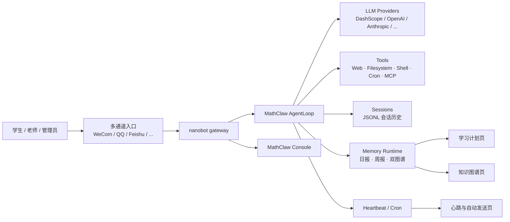

<div align="center">


# MathClaw

**面向初高中数学学习场景的多通道 AI 学习助手**

把解题工作台、学习计划、知识图谱、自动总结和多平台消息接入，收进同一套工作流。

[](https://www.python.org/downloads/)
[](#控制台模块)
[](#通道与接入方式)
[](#当前能力一览)
[](#学习记忆与自动化)
[](#模型与工具能力)
[](LICENSE)

[**中文**](README.md) · [**English**](README_EN.md) · [**🚀 快速开始**](#快速开始) · [**🧩 核心模块**](#core-modules) · [**🖥️ 控制台模块**](#控制台模块) · [**📡 通道接入**](#通道与接入方式) · [**🛠️ 模型与工具**](#模型与工具能力) · [**💬 Communication**](COMMUNICATION.md)

**📐 数学解题工作台 • 🗓️ 学习计划与自动总结 • 🕸️ 知识点 / 错题图谱**  
**📡 多通道接入 • ⏰ Heartbeat + Cron • 🛠️ MCP / Tools / Skills**

</div>

---

## 🎯 项目定位

MathClaw 是当前这套仓库里真正运行中的版本，不再沿用旧版 README 里提到的 `start.sh`、`/api/config/quickstart` 或 React/FastAPI 那套路径。  
现在的产品形态是：

- 以 `nanobot` 运行时为底座的 **数学学习 Agent**
- 一套定制过的 **MathClaw 控制台**，同时覆盖学生工作区和管理工作区
- 一套面向学习场景的 **记忆、计划、心跳、错题图谱** 工作流
- 一套可直接接入 **企业微信 / QQ / 飞书 / Telegram / Slack / WhatsApp / Email / Matrix / Discord / 微信 / 钉钉 / MoChat** 的多通道网关

如果你要理解这仓库“现在到底能做什么”，看下面这张表最直接。

## 🧩 当前能力一览

| 模块 | 当前能力 | 对应代码 |
| --- | --- | --- |
| 🧠 解题工作台 | 单对话工作台；支持文本、图片、PDF 上传；前端支持 Markdown、列表、表格渲染 | `console/main.js` · `console/serve.py` |
| 🗓️ 学习计划 | 根据每日/每周学习记忆生成今日状态、本周计划、优先复习知识点、重点纠错方向 | `nanobot/agent/memory.py` · `workspace/cron/jobs.json` |
| 🕸️ 记忆图谱 | 生成知识点图谱与错题图谱，支持焦点/总览视图、节点详情、删除节点 | `workspace/memory/graphs/*` · `console/main.js` |
| ⏰ 自动总结与心跳 | 支持日报、周报、定时任务与 `HEARTBEAT.md` 周期唤醒执行 | `nanobot/cron/service.py` · `nanobot/heartbeat/service.py` |
| 📡 多通道网关 | 渠道收消息、路由到 Agent、聚合流式输出、重试发送 | `nanobot/channels/manager.py` · `nanobot/cli/commands.py` |
| 🛠️ 模型与工具 | 多模型提供商路由、Web Search/Web Fetch、文件系统、Shell、Cron、消息回写、MCP、子代理 | `nanobot/providers/registry.py` · `nanobot/agent/loop.py` |
| ✨ 自定义输出 Skill | 为附件回复追加风格化的二次输出框，例如“竞赛教练点拨” | `nanobot/agent/custom_output_skills.py` |
| 🧾 会话与学习记忆 | 会话 JSONL 持久化、每日记忆、周总结、图谱快照、学习状态沉淀 | `nanobot/session/manager.py` · `nanobot/agent/memory.py` |

## ✨ 核心特性

<table>
  <tr>
    <td width="25%">
      <strong>数学学习工作流</strong><br/>
      围绕初高中数学场景定制，强调分步讲解、薄弱点识别、错因归纳和后续复习。
    </td>
    <td width="25%">
      <strong>学生 / 管理双视角</strong><br/>
      同一套控制台里既有学生工作区，也有通道、模型、心跳、运行状态等后台视图。
    </td>
    <td width="25%">
      <strong>多通道统一接入</strong><br/>
      可将同一个 MathClaw Agent 接到企业微信、QQ、飞书等多个入口，消息与状态统一回流。
    </td>
    <td width="25%">
      <strong>可扩展工具链</strong><br/>
      除内置文件、Web、Shell、Cron 外，还支持 MCP 服务和 channel plugin 扩展。
    </td>
  </tr>
</table>

<a id="core-modules"></a>

## 🔗 核心模块

<details>
<summary><b>🧠 解题工作台</b></summary>
<br />
- 面向学生的单对话数学工作台
- 支持文本、图片、截图和 PDF 上传
- 回答区域支持 Markdown、列表、代码块和表格渲染
- 支持连续追问，不再依赖旧版多会话历史列表
- 附件回复后可叠加自定义输出 Skill，例如“竞赛教练点拨”
</details>

<hr />

<details>
<summary><b>🗓️ 学习计划</b></summary>
<br />
- 自动汇总今日状态、本周计划和明日建议
- 从学习记忆里抽取优先复习知识点与重点纠错方向
- 给出每天建议主题与练习量/难度剂量
- 页面设计偏学生工作台，不是后台报表
</details>

<hr />

<details>
<summary><b>🕸️ 知识点图谱与错题图谱</b></summary>
<br />
- 同时维护知识点图谱与错题图谱两套视图
- 支持焦点 / 总览切换、节点高亮、关系图例和详情面板
- 知识点图谱强调前置、相似、包含、关联关系
- 错题图谱强调错误模式、重复出现、纠正建议和风险等级
- 节点详情支持直接删除，便于老师或管理员清理图谱
</details>

<hr />

<details>
<summary><b>⏰ 自动总结与心跳</b></summary>
<br />

- 工作区内置 `MathClaw Daily Summary` 与 `MathClaw Weekly Summary`
- `HEARTBEAT.md` 会被周期性检查，用于执行持续性任务而不是一次性提醒
- `cron/jobs.json` 保存定时任务、上下次执行时间与历史结果
- 控制台内有独立的心跳页面展示状态、节律与排查顺序

</details>

<hr />

<details>
<summary><b>📡 多通道接入</b></summary>
<br />

- 当前内置 WeCom、QQ、Feishu、Telegram、Slack、Email、Discord、Matrix、Weixin、DingTalk、WhatsApp、MoChat
- `nanobot gateway` 统一负责通道启动、消息接入、流式输出聚合和失败重试
- 支持运行时参数直接覆盖通道配置，适合部署与调试
- 同时支持 Python entry points 方式扩展 channel plugin

</details>

<hr />

<details>
<summary><b>🛠️ 模型、工具与 MCP</b></summary>
<br />

- Provider registry 已内置 DashScope、OpenAI、Anthropic、DeepSeek、Gemini、OpenRouter、Ollama 等多种路由
- 默认工具链包括文件系统、Shell、Web Search、Web Fetch、Cron、消息回写、子代理与 MCP
- 可通过控制台查看当前模型链路、上下文窗口、工具能力和工作区限制
- 适合把“教学能力”和“运维能力”放在同一套系统里统一管理

</details>

<hr />

<details>
<summary><b>✨ 自定义输出 Skill</b></summary>
<br />

- 支持在附件类回复结束后追加第二个风格化回复框
- Skill 存储在 `workspace/custom_output_skills.json`
- 当前仓库已支持启用、停用、删除与控制台查看
- 适合扩展“竞赛教练点拨”“压轴题提醒”“考试规范检查”等附加输出风格

</details>

## 🏗️ 系统架构



## 🖥️ 控制台模块

当前前端不是“一个简单聊天页”，而是围绕学习和运营拆出来的一组页面：

| 页面 | 面向角色 | 当前用途 |
| --- | --- | --- |
| 🧠 解题工作台 | 学生 | 单对话学习工作台，支持附件上传、追问、Markdown 表格回答 |
| 🗓️ 学习计划 | 学生 | 展示今日状态、本周计划、明日建议、复习优先级与练习量 |
| 🕸️ 记忆 | 学生 / 教师 | 查看知识点图谱、错题图谱、节点详情与关联关系 |
| 📊 运行状态 | 管理员 | 查看系统健康、模型链路、工具能力、启用通道与附件处理链路 |
| 📡 频道 | 管理员 | 查看各通道启用状态、今日消息量、会话数、最近活跃时间 |
| ❤️ 心跳 | 管理员 | 查看自动发送任务、日报/周报节律、最近结果与排查顺序 |
| ✨ Skills | 管理员 | 管理附件回复后的额外输出 Skill |
| 🛠️ MCP / Agent 配置 / 模型配置 | 管理员 | 查看当前工具摘要、Agent 边界和模型链路 |

## 🚀 快速开始

### 1. 环境要求

- Python `3.11+`
- Linux / macOS / WSL 环境更适合部署
- 一个可用的模型 API Key
- 可选：Node.js `20+`（只有在使用 WhatsApp bridge 时需要）

### 2. 安装

```bash
git clone https://github.com/MathClaw-ruc/MathClaw.git
cd MathClaw

python -m venv .venv
source .venv/bin/activate
python -m pip install -U pip
python -m pip install -e .
```

如果你需要企业微信 SDK：

```bash
python -m pip install -e ".[wecom]"
```

### 3. 初始化配置与工作区

```bash
nanobot onboard --workspace ./workspace
```

默认会生成：

- 配置文件：`~/.nanobot/config.json`
- 工作区模板：`./workspace/AGENTS.md`、`USER.md`、`HEARTBEAT.md`、`cron/jobs.json`

你也可以使用交互式初始化：

```bash
nanobot onboard --workspace ./workspace --wizard
```

### 4. 写入最小配置

下面是一个和当前 MathClaw 工作流匹配的最小示例：

```json
{
  "agents": {
    "defaults": {
      "workspace": "/path/to/MathClaw/workspace",
      "model": "qwen3.5-plus",
      "provider": "dashscope",
      "timezone": "Asia/Shanghai"
    }
  },
  "providers": {
    "dashscope": {
      "api_key": "YOUR_DASHSCOPE_API_KEY"
    }
  },
  "tools": {
    "web": {
      "search": {
        "provider": "tavily",
        "api_key": "YOUR_TAVILY_API_KEY"
      }
    }
  }
}
```

> 当前代码里默认的控制台演示链路也是围绕 DashScope / Qwen 与 Tavily 这类搜索增强来组织的。

### 5. 启动网关

```bash
nanobot gateway --workspace ./workspace
```

默认网关端口是 `18790`。

### 6. 启动控制台

```bash
cd console
NANOBOT_CONSOLE_WORKSPACE=../workspace python serve.py
```

默认控制台地址：

```text
http://127.0.0.1:6006
```

如果你想沿用当前线上部署常见的 `6008` 端口：

```bash
cd console
NANOBOT_CONSOLE_WORKSPACE=../workspace NANOBOT_CONSOLE_PORT=6008 python serve.py
```

### 7. 直接用 CLI 对话

```bash
nanobot agent --workspace ./workspace -m "帮我讲一下导数单调性判断"
```

## 📡 通道与接入方式

### 📮 内置通道

当前仓库内置的 channel 模块包括：

- WeCom
- QQ
- Feishu
- Telegram
- Slack
- Email
- Discord
- Matrix
- Weixin
- DingTalk
- WhatsApp
- MoChat

此外还支持通过 Python entry points 加载外部 channel plugin，参考：[docs/CHANNEL_PLUGIN_GUIDE.md](docs/CHANNEL_PLUGIN_GUIDE.md)。

### 🧪 运行时覆盖示例

企业微信：

```bash
nanobot gateway --workspace ./workspace \
  --wecom \
  --wecom-bot-id YOUR_WECOM_BOT_ID \
  --wecom-secret YOUR_WECOM_SECRET \
  --wecom-allow-from "*"
```

QQ：

```bash
nanobot gateway --workspace ./workspace \
  --qq \
  --qq-app-id YOUR_QQ_APP_ID \
  --qq-secret YOUR_QQ_SECRET \
  --qq-allow-from "*"
```

飞书：

```bash
nanobot gateway --workspace ./workspace \
  --feishu \
  --feishu-app-id YOUR_FEISHU_APP_ID \
  --feishu-app-secret YOUR_FEISHU_APP_SECRET \
  --feishu-allow-from "*"
```

对于需要交互式授权的通道，可以使用：

```bash
nanobot channels login <channel_name>
```

查看当前通道启用情况：

```bash
nanobot channels status
```

## 🛠️ 模型与工具能力

### 🤖 当前支持的模型提供商

当前 provider registry 已内置：

- DashScope
- OpenAI
- Anthropic
- DeepSeek
- Gemini
- OpenRouter
- Azure OpenAI
- Zhipu AI
- Moonshot
- MiniMax
- Mistral
- Step Fun
- Groq
- Ollama
- vLLM
- OpenVINO Model Server
- OpenAI Codex
- GitHub Copilot
- 自定义 OpenAI-compatible endpoint

### 🧰 Agent 默认工具

`AgentLoop` 默认注册的能力包括：

- 文件读取 / 写入 / 编辑 / 列目录
- Shell 执行
- Web Search / Web Fetch
- 消息回写
- 子代理拉起
- Cron 定时任务
- MCP 工具接入

这些能力会在运行时按工作区、MCP 配置和安全限制组合起来。

## 🧠 学习记忆与自动化

MathClaw 当前这套仓库最有辨识度的能力，不是“会聊天”，而是把学习状态沉淀成可持续使用的结构化记忆：

- 每日学习记忆
- 每周学习总结
- 知识点图谱
- 错题图谱
- 明日建议
- 周期性 heartbeat 任务
- 可直接落盘的 cron 任务

相关工作区文件：

- `workspace/HEARTBEAT.md`
- `workspace/cron/jobs.json`
- `workspace/custom_output_skills.json`
- `workspace/memory/graphs/knowledge_graph.json`
- `workspace/memory/graphs/error_graph.json`

## 📁 仓库结构

```text
.
├── nanobot/                 # 核心运行时：agent、channels、providers、memory、cron、heartbeat
├── console/                 # MathClaw 控制台：静态前端 + serve.py API 壳层
├── workspace/               # 仓库自带的 MathClaw persona、计划与模板
├── bridge/                  # WhatsApp bridge（Node 20+）
├── docs/                    # 文档，如 channel plugin guide
└── tests/                   # 运行时、工具、安全、通道等测试
```

## ℹ️ 这版 README 特别说明

这份 README 是按照当前仓库真实存在的实现重写的，重点对应的是：

- `nanobot gateway`
- `nanobot agent`
- `console/serve.py`
- `workspace/*`
- `nanobot/agent/*`

因此它不会再描述旧版 quickstart API、旧版启动脚本或旧版前后端架构。

## 📄 License

This project is released under the [MIT License](LICENSE).
