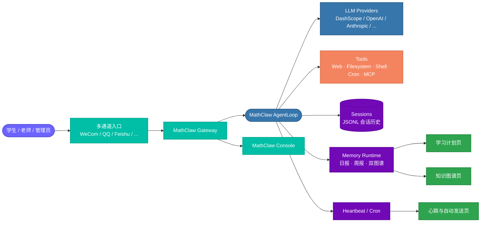
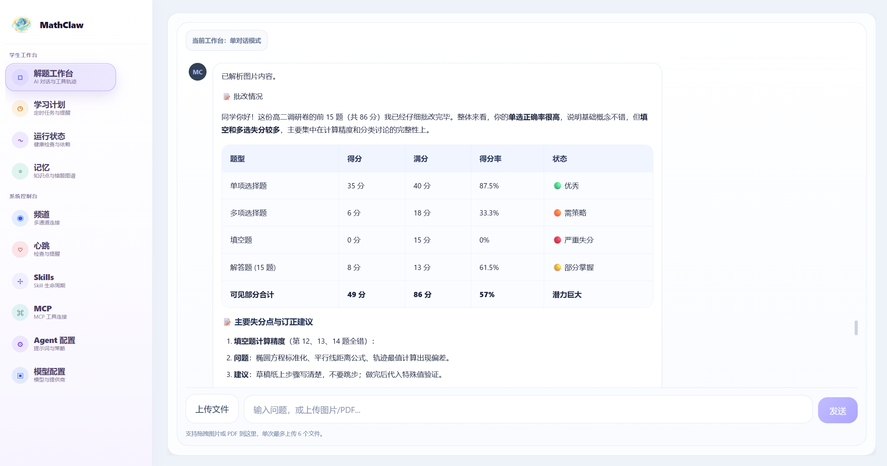
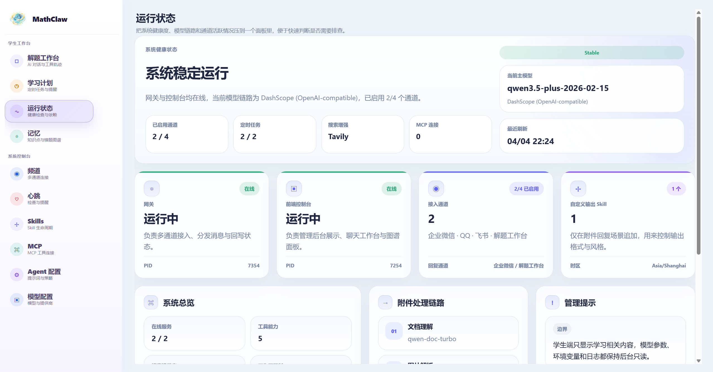
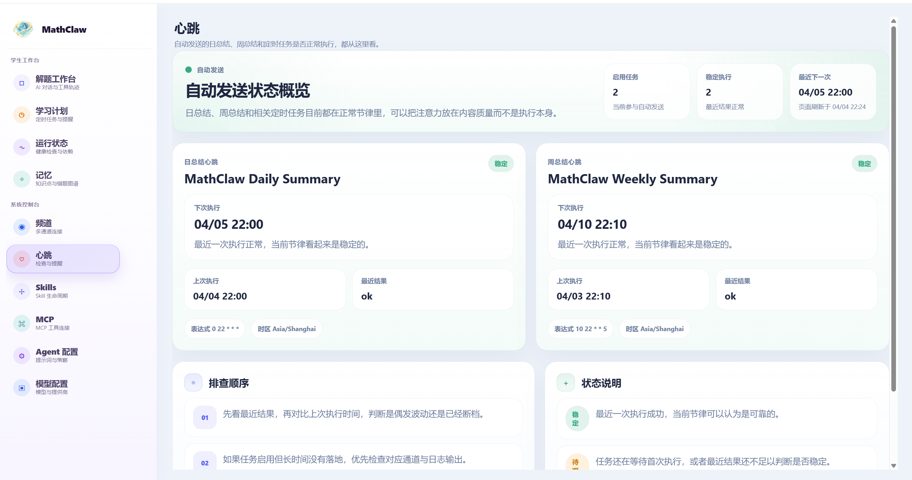
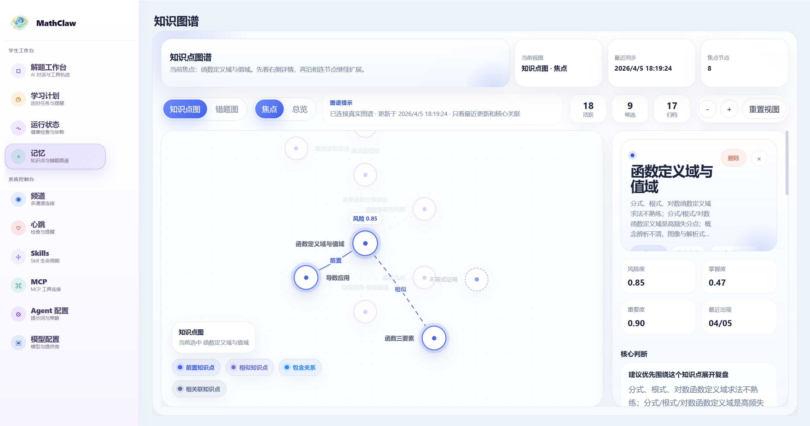
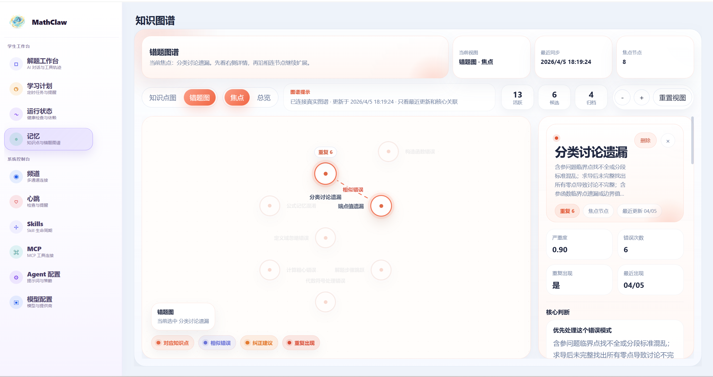
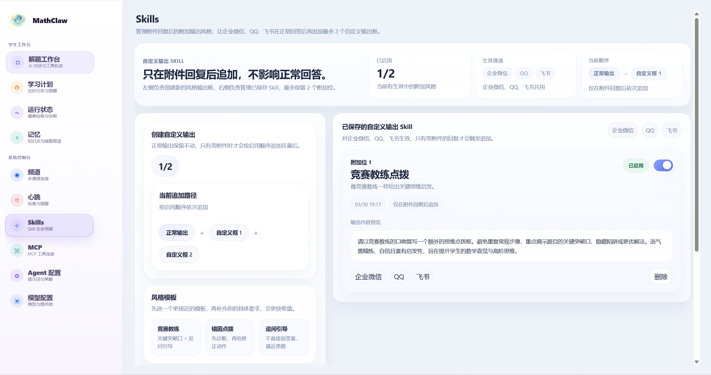
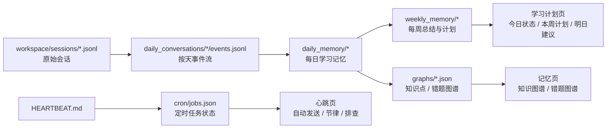

<p align="center">
  <br>
  
  <br>
</p>

<h1 align="center">MathClaw</h1>

<p align="center">
  面向初高中数学学习场景的多通道 AI 学习助手
</p>

<p align="center">
  <a href="README.md">中文</a> &nbsp;｜&nbsp; <a href="README_EN.md">English</a>
</p>

<p align="center">
  
  
  
  
  
</p>

> ⭐ 如果你喜欢这个项目，请点击右上角的 "Star" 按钮支持我们。你的支持是我们前进的动力！

## 📝 简介

MathClaw 是一套面向初高中数学学习场景的多通道 AI 学习系统，围绕以下核心链路工作：

```
多通道消息接入 → 解题工作台 → 薄弱点诊断 → 学习记忆沉淀 → 图谱 / 计划 / 自动总结
```

核心组成包括：

- 以 `mathclaw` 运行时为基础的 **数学学习 Agent**
- 同时覆盖学生工作区与管理工作区的 **MathClaw 控制台**
- 围绕 **学习计划、知识图谱、错题图谱与自动总结** 构建的学习记忆工作流
- 可接入 **企业微信 / QQ / 飞书 / Telegram / Slack / WhatsApp / Email / Matrix / Discord / 微信 / 钉钉 / MoChat** 的多通道网关

## ✨ 主要特性

- **📐 数学场景专项定制**：围绕初高中数学场景，强调分步讲解、薄弱点识别、错因归纳和后续复习。
- **🖼️ 多模态输入支持**：支持文本、图片、截图和 PDF 上传，适应真实做题场景。
- **🕸️ 结构化学习记忆**：自动沉淀知识点图谱与错题图谱，持续追踪学习状态。
- **🗓️ 学习计划与自动总结**：每日记忆、周报、明日建议，由 heartbeat + cron 驱动。
- **📡 多通道统一接入**：同一个 Agent 可接入企业微信、QQ、飞书等多个入口，消息与状态统一回流。
- **🖥️ 学生 / 管理双视角控制台**：学生工作区与运维管理在同一套控制台里。
- **🔌 可扩展工具链**：文件、Web、Shell、Cron、MCP 服务和 channel plugin 均可扩展。

## 🏗️ 系统架构



## 📁 仓库结构

```text
.
├── mathclaw/                 # 核心运行时：agent、channels、providers、memory、cron、heartbeat
├── console/                 # MathClaw 控制台：静态前端 + serve.py API 壳层
├── workspace/               # 仓库自带的 MathClaw persona、计划与模板
├── bridge/                  # WhatsApp bridge（Node 20+）
├── docs/                    # 文档，如 channel plugin guide
└── tests/                   # 运行时、工具、安全、通道等测试
```

## 🚀 快速开始

### 1. 安装

```bash
git clone https://github.com/MathClaw-ruc/MathClaw.git
cd MathClaw

python -m venv .venv
source .venv/bin/activate
python -m pip install -U pip
python -m pip install -e .
```

如需启用企业微信 SDK：

```bash
python -m pip install -e ".[wecom]"
```

### 2. 初始化配置与工作区

```bash
mathclaw onboard --workspace ./workspace
```

默认会生成：

- 配置文件：`~/.mathclaw/config.json`
- 工作区模板：`./workspace/AGENTS.md`、`USER.md`、`HEARTBEAT.md`、`cron/jobs.json`

支持交互式初始化：

```bash
mathclaw onboard --workspace ./workspace --wizard
```

### 3. 写入最小配置

```json
{
  "agents": {
    "defaults": {
      "workspace": "/path/to/MathClaw/workspace",
      "model": "qwen3.5-plus",
      "provider": "dashscope",
      "timezone": "Asia/Shanghai"
    }
  },
  "providers": {
    "dashscope": {
      "api_key": "YOUR_DASHSCOPE_API_KEY"
    }
  },
  "tools": {
    "web": {
      "search": {
        "provider": "tavily",
        "api_key": "YOUR_TAVILY_API_KEY"
      }
    }
  }
}
```

> 默认演示链路使用 DashScope / Qwen 与 Tavily 作为模型与搜索增强组合。

### 4. 启动

```bash
# 启动网关（默认端口 18790）
mathclaw gateway --workspace ./workspace

# 启动控制台（默认地址 http://127.0.0.1:6006）
cd console
MATHCLAW_CONSOLE_WORKSPACE=../workspace python serve.py

# 或直接用 CLI 对话
mathclaw agent --workspace ./workspace -m "帮我讲一下导数单调性判断"
```

如需使用其他端口：

```bash
cd console
MATHCLAW_CONSOLE_WORKSPACE=../workspace MATHCLAW_CONSOLE_PORT=6008 python serve.py
```

> **环境要求**：Python `3.11+`；Linux / macOS / WSL 更适合部署；可选 Node.js `20+`（仅 WhatsApp bridge 需要）。

---

## 📸 功能预览

<table>
  <tr>
    <td align="center" width="50%"><b>解题工作台</b><br /></td>
    <td align="center" width="50%"><b>学习计划</b><br /></td>
  </tr>
  <tr>
    <td align="center" width="50%"><b>运行状态</b><br /></td>
    <td align="center" width="50%"><b>心跳与自动任务</b><br /></td>
  </tr>
  <tr>
    <td align="center" width="50%"><b>知识图谱</b><br /></td>
    <td align="center" width="50%"><b>错题图谱</b><br /></td>
  </tr>
  <tr>
    <td align="center" colspan="2"><b>Skills</b><br /></td>
  </tr>
</table>

---

## 🧩 核心能力一览

| 模块 | 当前能力 | 对应代码 |
| --- | --- | --- |
| 🧠 解题工作台 | 单对话工作台；支持文本、图片、PDF 上传；前端支持 Markdown、列表、表格渲染 | `console/main.js` · `console/serve.py` |
| 🗓️ 学习计划 | 根据每日/每周学习记忆生成今日状态、本周计划、优先复习知识点、重点纠错方向 | `mathclaw/agent/memory.py` · `workspace/cron/jobs.json` |
| 🕸️ 记忆图谱 | 生成知识点图谱与错题图谱，支持焦点/总览视图、节点详情、删除节点 | `workspace/memory/graphs/*` · `console/main.js` |
| ⏰ 自动总结与心跳 | 支持日报、周报、定时任务与 `HEARTBEAT.md` 周期唤醒执行 | `mathclaw/cron/service.py` · `mathclaw/heartbeat/service.py` |
| 📡 多通道网关 | 渠道收消息、路由到 Agent、聚合流式输出、重试发送 | `mathclaw/channels/manager.py` · `mathclaw/cli/commands.py` |
| 🛠️ 模型与工具 | 多模型提供商路由、Web Search/Web Fetch、文件系统、Shell、Cron、消息回写、MCP、子代理 | `mathclaw/providers/registry.py` · `mathclaw/agent/loop.py` |
| ✨ 自定义输出 Skill | 为附件回复追加风格化的二次输出框，例如"竞赛教练点拨" | `mathclaw/agent/custom_output_skills.py` |
| 🧾 会话与学习记忆 | 会话 JSONL 持久化、每日记忆、周总结、图谱快照、学习状态沉淀 | `mathclaw/session/manager.py` · `mathclaw/agent/memory.py` |

## 🖥️ 控制台模块

| 页面 | 面向角色 | 主要作用 |
| --- | --- | --- |
| 🧠 解题工作台 | 学生 | 单对话学习工作台，支持附件上传、追问、Markdown 表格回答 |
| 🗓️ 学习计划 | 学生 | 展示今日状态、本周计划、明日建议、复习优先级与练习量 |
| 🕸️ 记忆 | 学生 / 教师 | 查看知识点图谱、错题图谱、节点详情与关联关系 |
| 📊 运行状态 | 管理员 | 查看系统健康、模型链路、工具能力、启用通道与附件处理链路 |
| 📡 频道 | 管理员 | 查看各通道启用状态、今日消息量、会话数、最近活跃时间 |
| ❤️ 心跳 | 管理员 | 查看自动发送任务、日报/周报节律、最近结果与排查顺序 |
| ✨ Skills | 管理员 | 管理附件回复后的额外输出 Skill |
| 🛠️ MCP / Agent 配置 / 模型配置 | 管理员 | 查看当前工具摘要、Agent 边界和模型链路 |

## 📡 通道与接入方式

### 内置通道

WeCom, QQ, Feishu, Telegram, Slack, Email, Discord, Matrix, Weixin, DingTalk, WhatsApp, MoChat

此外还支持通过 Python entry points 加载外部 channel plugin，参考：[docs/CHANNEL_PLUGIN_GUIDE.md](docs/CHANNEL_PLUGIN_GUIDE.md)。

### 运行时覆盖示例

<details><summary><b>企业微信</b></summary>

```bash
mathclaw gateway --workspace ./workspace \
  --wecom \
  --wecom-bot-id YOUR_WECOM_BOT_ID \
  --wecom-secret YOUR_WECOM_SECRET \
  --wecom-allow-from "*"
```

</details>

<details><summary><b>QQ</b></summary>

```bash
mathclaw gateway --workspace ./workspace \
  --qq \
  --qq-app-id YOUR_QQ_APP_ID \
  --qq-secret YOUR_QQ_SECRET \
  --qq-allow-from "*"
```

</details>

<details><summary><b>飞书</b></summary>

```bash
mathclaw gateway --workspace ./workspace \
  --feishu \
  --feishu-app-id YOUR_FEISHU_APP_ID \
  --feishu-app-secret YOUR_FEISHU_APP_SECRET \
  --feishu-allow-from "*"
```

</details>

交互式授权与状态查看：

```bash
mathclaw channels login <channel_name>
mathclaw channels status
```

## 🛠️ 模型与工具能力

### 当前支持的模型提供商

DashScope, OpenAI, Anthropic, DeepSeek, Gemini, OpenRouter, Azure OpenAI, Zhipu AI, Moonshot, MiniMax, Mistral, Step Fun, Groq, Ollama, vLLM, OpenVINO Model Server, OpenAI Codex, GitHub Copilot, 自定义 OpenAI-compatible endpoint

### Agent 默认工具

`AgentLoop` 默认注册的能力包括：

- 文件读取 / 写入 / 编辑 / 列目录
- Shell 执行
- Web Search / Web Fetch
- 消息回写
- 子代理拉起
- Cron 定时任务
- MCP 工具接入

这些能力会在运行时按工作区、MCP 配置和安全限制组合起来。

## 🧠 学习记忆与自动化

MathClaw 当前这套仓库最有辨识度的能力，不是"会聊天"，而是把学习状态沉淀成可持续使用的结构化记忆：

- 每日学习记忆
- 每周学习总结
- 知识点图谱
- 错题图谱
- 明日建议
- 周期性 heartbeat 任务
- 可直接落盘的 cron 任务

### 🗂️ 历史文件分别做什么

| 路径 | 作用 |
| --- | --- |
| `workspace/sessions/*.jsonl` | 原始会话日志，保存控制台和各通道的完整聊天记录 |
| `workspace/memory/daily_conversations/*/events.jsonl` | 按天整理过的事件流，作为每日记忆和总结任务的输入 |
| `workspace/memory/daily_memory/*/*.json` / `.md` | 每日学习记忆快照，产出今日状态、明日建议等结构化结果 |
| `workspace/memory/weekly_memory/*/*.md` | 每周总结与周计划，给学习计划页和周报提供汇总内容 |
| `workspace/memory/graphs/*.json` | 知识点图谱和错题图谱的实际数据源 |
| `workspace/cron/jobs.json` | 自动任务配置与执行状态，包括上下次执行时间和历史结果 |
| `workspace/HEARTBEAT.md` | 心跳任务的持续性指令入口，供 heartbeat 服务周期检查 |

### 🔄 数据流



## 📄 License

This project is released under the [MIT License](LICENSE).


## 🙏 致谢

MathClaw 的设计与演进参考了以下开源项目，在此表示感谢：

- [HKUDS/nanobot](https://github.com/HKUDS/nanobot)
- [ymx10086/ResearchClaw](https://github.com/ymx10086/ResearchClaw)
