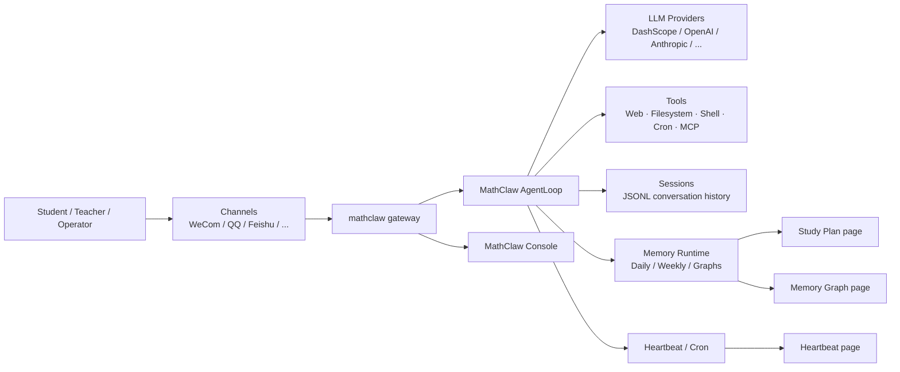
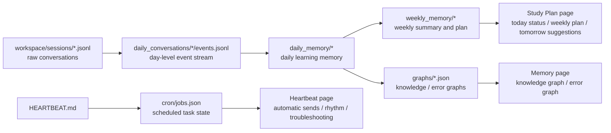

<p align="center">
  <br>
  
  <br>
</p>

<h1 align="center">MathClaw</h1>

<p align="center">
  A multi-channel AI learning assistant for junior and senior high school mathematics
</p>

<p align="center">
  <a href="README.md">中文</a> &nbsp;｜&nbsp; <a href="README_EN.md">English</a> &nbsp;｜&nbsp; <a href="COMMUNICATION.md">💬 Communication</a>
</p>

<p align="center">
  
  
  
  
  
</p>

> ⭐ If you like this project, please click the "Star" button in the upper right corner to support us!

## 📝 Introduction

MathClaw is a multi-channel AI learning system for junior and senior high school mathematics, built around the following core pipeline:

```
Multi-channel intake → Tutoring workspace → Weakness diagnosis → Memory consolidation → Graphs / Plans / Summaries
```

Core components include:

- a **math tutoring agent** built on top of the `mathclaw` runtime
- a customized **MathClaw console** with both student-facing and operator-facing pages
- a learning workflow centered on **study plans, knowledge graphs, error graphs, and scheduled summaries**
- a **multi-channel gateway** for WeCom, QQ, Feishu, Telegram, Slack, WhatsApp, Email, Matrix, Discord, and more

## ✨ Key Features

- **📐 Math-first tutoring workflow**: Built for secondary-school mathematics, with guided explanations, weakness analysis, and correction-oriented feedback.
- **🖼️ Multi-modal input**: Supports text, image, screenshot, and PDF input for real-world problem-solving scenarios.
- **🕸️ Structured learning memory**: Automatically builds knowledge graphs and error graphs for continuous learning state tracking.
- **🗓️ Study plans & auto-summaries**: Daily memory, weekly reports, and tomorrow suggestions driven by heartbeat + cron.
- **📡 Unified multi-channel gateway**: Connect the same agent to WeCom, QQ, Feishu, and more, with unified message routing.
- **🖥️ Student + operator console**: Student workspace and operations management in one console.
- **🔌 Extensible toolchain**: Filesystem, web, shell, cron, MCP services, and channel plugins are all extensible.

## 🏗️ Architecture



## 📁 Repository Structure

```text
.
├── mathclaw/                 # Core runtime: agent, channels, providers, memory, cron, heartbeat
├── console/                 # MathClaw console: static frontend shell + serve.py API layer
├── workspace/               # Repo-owned MathClaw persona, plans, and templates
├── bridge/                  # WhatsApp bridge (Node 20+)
├── docs/                    # Docs such as the channel plugin guide
└── tests/                   # Runtime, tool, security, and channel tests
```

## 🚀 Quick Start

### 1. Install

```bash
git clone https://github.com/MathClaw-ruc/MathClaw.git
cd MathClaw

python -m venv .venv
source .venv/bin/activate
python -m pip install -U pip
python -m pip install -e .
```

To enable WeCom support:

```bash
python -m pip install -e ".[wecom]"
```

### 2. Initialize config and workspace

```bash
mathclaw onboard --workspace ./workspace
```

This creates:

- config: `~/.mathclaw/config.json`
- workspace templates: `./workspace/AGENTS.md`, `USER.md`, `HEARTBEAT.md`, `cron/jobs.json`

Interactive setup:

```bash
mathclaw onboard --workspace ./workspace --wizard
```

### 3. Minimal config example

```json
{
  "agents": {
    "defaults": {
      "workspace": "/path/to/MathClaw/workspace",
      "model": "qwen3.5-plus",
      "provider": "dashscope",
      "timezone": "Asia/Shanghai"
    }
  },
  "providers": {
    "dashscope": {
      "api_key": "YOUR_DASHSCOPE_API_KEY"
    }
  },
  "tools": {
    "web": {
      "search": {
        "provider": "tavily",
        "api_key": "YOUR_TAVILY_API_KEY"
      }
    }
  }
}
```

### 4. Launch

```bash
# Start the gateway (default port 18790)
mathclaw gateway --workspace ./workspace

# Start the console (default address http://127.0.0.1:6006)
cd console
MATHCLAW_CONSOLE_WORKSPACE=../workspace python serve.py

# Or talk to the agent from CLI
mathclaw agent --workspace ./workspace -m "Teach me monotonicity from derivatives"
```

To use a different port:

```bash
cd console
MATHCLAW_CONSOLE_WORKSPACE=../workspace MATHCLAW_CONSOLE_PORT=6008 python serve.py
```

> **Requirements**: Python `3.11+`; Linux / macOS / WSL recommended for deployment; optional Node.js `20+` (only for WhatsApp bridge).

---

## 📸 Feature Preview

<table>
  <tr>
    <td align="center" width="50%"><b>Chat Workspace</b><br /></td>
    <td align="center" width="50%"><b>Study Plan</b><br /></td>
  </tr>
  <tr>
    <td align="center" width="50%"><b>Runtime Status</b><br /></td>
    <td align="center" width="50%"><b>Heartbeat & Auto Tasks</b><br /></td>
  </tr>
  <tr>
    <td align="center" width="50%"><b>Knowledge Graph</b><br /></td>
    <td align="center" width="50%"><b>Error Graph</b><br /></td>
  </tr>
  <tr>
    <td align="center" colspan="2"><b>Skills</b><br /></td>
  </tr>
</table>

---

## 🧩 Core Capabilities

| Module | Current capability | Main code |
| --- | --- | --- |
| 🧠 Chat Workspace | Single-thread tutoring workspace with text, image, and PDF upload; Markdown/table rendering | `console/main.js` · `console/serve.py` |
| 🗓️ Study Plan | Daily status, weekly plan, tomorrow suggestions, focus topics, and correction directions | `mathclaw/agent/memory.py` · `workspace/cron/jobs.json` |
| 🕸️ Memory Graphs | Knowledge graph + error graph, focus/overview modes, node details, node deletion | `workspace/memory/graphs/*` · `console/main.js` |
| ⏰ Heartbeat & Summaries | Daily summary, weekly summary, scheduled jobs, `HEARTBEAT.md` wake-up execution | `mathclaw/cron/service.py` · `mathclaw/heartbeat/service.py` |
| 📡 Multi-channel Gateway | Channel intake, routing, streaming coalescing, outbound retry | `mathclaw/channels/manager.py` · `mathclaw/cli/commands.py` |
| 🛠️ Models & Tools | Multi-provider routing, Web Search/Web Fetch, filesystem tools, shell, cron, message send-back, MCP, subagents | `mathclaw/providers/registry.py` · `mathclaw/agent/loop.py` |
| ✨ Custom Output Skills | Optional follow-up output boxes after attachment replies | `mathclaw/agent/custom_output_skills.py` |
| 🧾 Sessions & Memory | JSONL session persistence, daily memory, weekly summaries, graph snapshots | `mathclaw/session/manager.py` · `mathclaw/agent/memory.py` |

## 🖥️ Console Modules

| Page | Audience | Primary role |
| --- | --- | --- |
| 🧠 Chat Workspace | Student | Single-thread tutoring workspace with attachment upload and rich Markdown answers |
| 🗓️ Study Plan | Student | Daily status, weekly plan, tomorrow suggestions, focus topics, practice load |
| 🕸️ Memory | Student / Teacher | Knowledge graph, error graph, node details, relation browsing |
| 📊 Runtime Status | Operator | Health summary, model chain, tool abilities, active channels, attachment pipeline |
| 📡 Channels | Operator | Per-channel enablement, daily message count, active sessions, last activity |
| ❤️ Heartbeat | Operator | Scheduled summaries, heartbeat rhythm, latest result, troubleshooting order |
| ✨ Skills | Operator | Manage custom output skills used after attachment replies |
| 🛠️ MCP / Agent Config / Models | Operator | View current tools, agent boundaries, and model chain |

## 📡 Channels and Integrations

### Built-in channels

WeCom, QQ, Feishu, Telegram, Slack, Email, Discord, Matrix, Weixin, DingTalk, WhatsApp, MoChat

External channel plugins are supported via Python entry points. See [docs/CHANNEL_PLUGIN_GUIDE.md](docs/CHANNEL_PLUGIN_GUIDE.md).

### Runtime override examples

<details><summary><b>WeCom</b></summary>

```bash
mathclaw gateway --workspace ./workspace \
  --wecom \
  --wecom-bot-id YOUR_WECOM_BOT_ID \
  --wecom-secret YOUR_WECOM_SECRET \
  --wecom-allow-from "*"
```

</details>

<details><summary><b>QQ</b></summary>

```bash
mathclaw gateway --workspace ./workspace \
  --qq \
  --qq-app-id YOUR_QQ_APP_ID \
  --qq-secret YOUR_QQ_SECRET \
  --qq-allow-from "*"
```

</details>

<details><summary><b>Feishu</b></summary>

```bash
mathclaw gateway --workspace ./workspace \
  --feishu \
  --feishu-app-id YOUR_FEISHU_APP_ID \
  --feishu-app-secret YOUR_FEISHU_APP_SECRET \
  --feishu-allow-from "*"
```

</details>

Interactive auth and status:

```bash
mathclaw channels login <channel_name>
mathclaw channels status
```

## 🛠️ Providers and Tools

### Supported providers

DashScope, OpenAI, Anthropic, DeepSeek, Gemini, OpenRouter, Azure OpenAI, Zhipu AI, Moonshot, MiniMax, Mistral, Step Fun, Groq, Ollama, vLLM, OpenVINO Model Server, OpenAI Codex, GitHub Copilot, custom OpenAI-compatible endpoints

### Default agent tools

`AgentLoop` currently registers:

- file read / write / edit / list
- shell execution
- web search / web fetch
- outbound message tool
- subagent spawn
- cron scheduling
- MCP tool servers

## 🧠 Learning Memory and Automation

What makes this repository distinctive is not just chat. It continuously turns tutoring activity into reusable learning memory:

- daily learning memory
- weekly summaries
- knowledge graphs
- error graphs
- tomorrow suggestions
- heartbeat tasks
- persisted cron schedules

### 🗂️ What each history path is for

| Path | Purpose |
| --- | --- |
| `workspace/sessions/*.jsonl` | Raw session logs for the console and external channels |
| `workspace/memory/daily_conversations/*/events.jsonl` | Day-bucketed event streams used as input to memory and summary jobs |
| `workspace/memory/daily_memory/*/*.json` / `.md` | Daily learning memory snapshots that power today-status and tomorrow-suggestion outputs |
| `workspace/memory/weekly_memory/*/*.md` | Weekly summaries and weekly plans used by the study-plan page and scheduled reports |
| `workspace/memory/graphs/*.json` | The actual data sources behind the knowledge graph and error graph views |
| `workspace/cron/jobs.json` | Scheduled job definitions plus runtime state such as last/next execution and run history |
| `workspace/HEARTBEAT.md` | Persistent task instructions checked by the heartbeat service |

### 🔄 Data flow



## 📄 License

This project is released under the [MIT License](LICENSE).


## 🙏 Acknowledgements

MathClaw draws inspiration from the following open-source projects, with thanks to their authors and communities:

- [HKUDS/nanobot](https://github.com/HKUDS/nanobot)
- [ymx10086/ResearchClaw](https://github.com/ymx10086/ResearchClaw)
